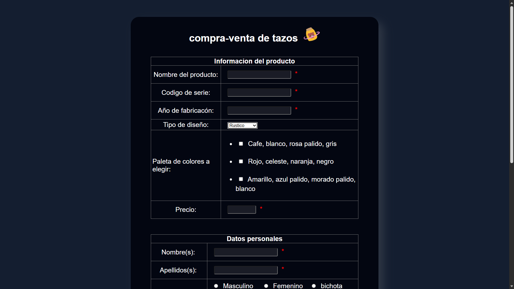
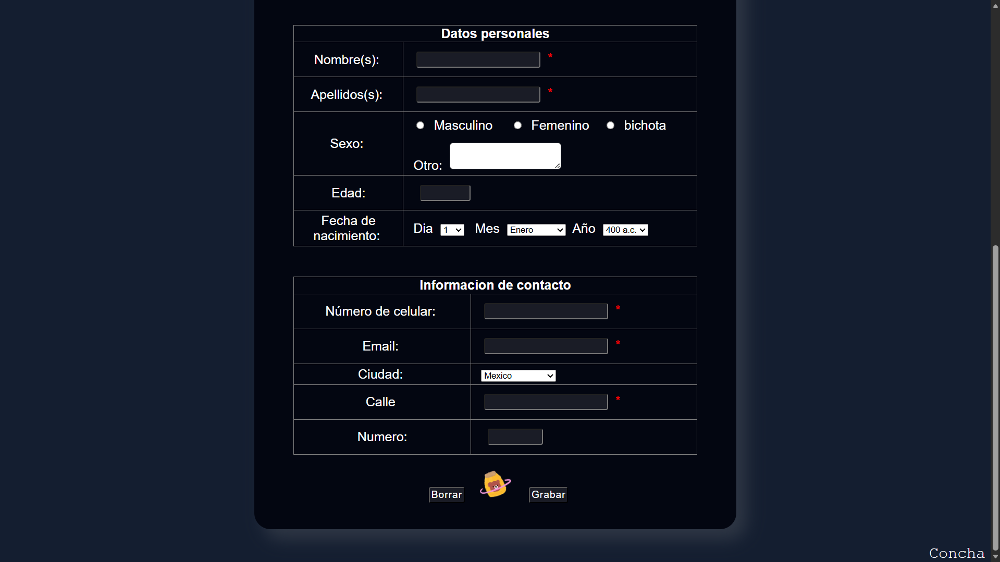

# Formulario-

Formulario web con distintos tipos de campos (inputs) para capturar información de un producto y datos personales/de contacto.  
El formulario está maquetado con estilos (CSS) y contiene validaciones básicas en JavaScript.

## Descripción del proyecto
Este proyecto contiene una página principal:

- **`formulario.html`**: formulario para “compra-venta de tazos”, con secciones como:
  - Información del producto (nombre, código de serie, año, diseño, colores, precio)
  - Datos personales (nombre, apellidos, sexo, edad, fecha de nacimiento)
  - Información de contacto (celular, email, ciudad, dirección)

Además incluye recursos gráficos:
- **`miel.png`**: imagen usada dentro del formulario
- **`coco.ico`**: ícono (favicon) de la página

## Lenguajes utilizados
- **HTML**: estructura del formulario, tablas, inputs, selects, etc.
- **CSS (inline / embebido)**: estilos dentro de la etiqueta `<style>` en `formulario.html`.
- **JavaScript (inline / embebido)**: validaciones dentro de la etiqueta `<script>`.

## Estructura del repositorio
- `formulario.html` → página principal del formulario
- `miel.png` → imagen usada en la interfaz
- `coco.ico` → favicon
- `README.md` → documentación del proyecto

## Cómo usarlo
1. Descarga o clona el repositorio.
2. Abre el archivo `formulario.html` en tu navegador (doble click o “Open with…”).
3. Llena el formulario y prueba las validaciones (por ejemplo en email, teléfono, nombre).

### Capturas del programa ejecutándose

**Vista 1:**

**Vista 2:**

## Autor
Hecho por **Itzel Monroy**.
